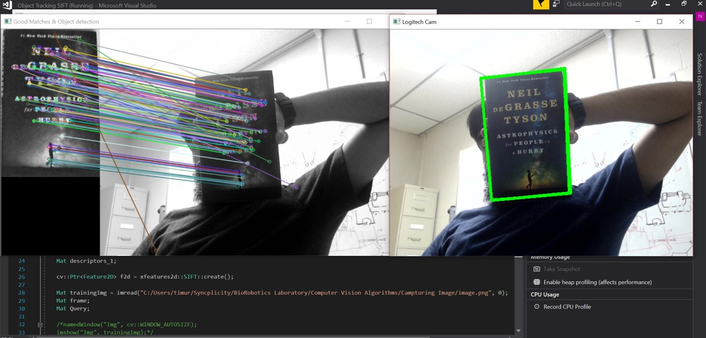
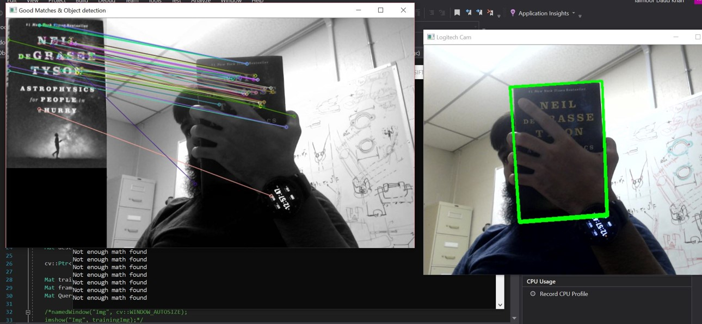

# Object Detection with SIFT

**Scale Invariant Feature Transform (or SIFT)** is a computer vision algorithm that can be used to extract useful keypoints and their descriptors from an image. As the name suggests the algorithm is robust to any scaling of the image and this makes it suitable for object detection. Unlike contemporary object detection algorithms, this does not require large training image datasets.

This code uses the _OpenCV_ library to demonstrate how SIFT can be used for object detection. The algorithm can be deconstructed into the following four steps

1. Capture an image (_Training Image_) of the object of interest and crop out any unnecessary details. The code assumes that the user already has it in a predefined folder.
2. Create a feature extractor to extract the features from the training image.
3. Create a feature matcher to look for the features in a _Query Image_.
4. Draw a bounding box around the detected object.

## Usage

To use and test this code, clone the repository and then run the project with Visual Studio in the debug mode. Make sure that the OpenCV library is properly configured with Visual Studio. Detailed instructions on how to do it can be found [here](https://docs.opencv.org/2.4/doc/tutorials/introduction/windows_visual_studio_Opencv/windows_visual_studio_Opencv.html).

Alternatively, users can also compile and run the _Random Object Detection.cpp_ file with their own prefered choice of compiler.

The user also needs to provide the correct path to their <Training Image> in _line 28_ of the _Random Object Detection.cpp_ file

`Mat trainingImg = imread("<user file path>", 0);`

## Example Results

The following images show the code succesfully detecting an object of interest, in this case it was the book _Astrophysics for People in a Hurry_ by _Neil Neil deGrasse Tyson_.

The algorithm does fairly well even for partially occluded objects.

## References
Lowe, D.G. Distinctive Image Features from Scale-Invariant Keypoints. International Journal of Computer Vision 60, 91–110 (2004). [PDF](https://www.cs.ubc.ca/~lowe/papers/ijcv04.pdf)
